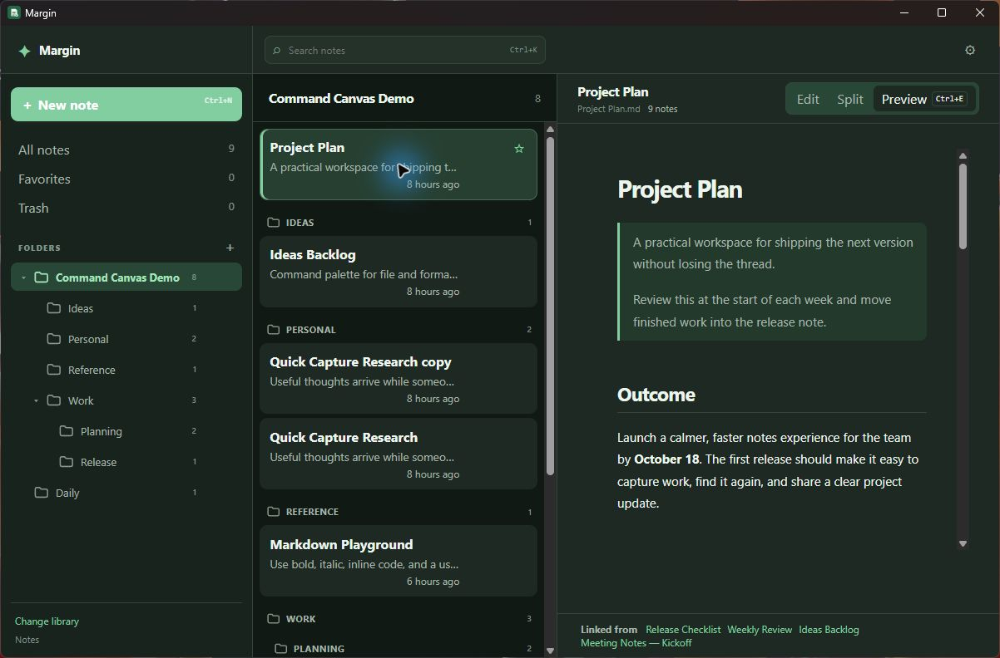
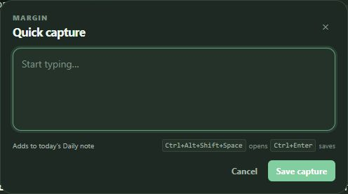

# Margin

Margin is a calm, local-first desktop workspace for ordinary Markdown notes. Pick a folder, write in `.md` files, and keep using that same folder in Explorer, Finder, Git, or another editor—there is no account, database, or proprietary note format.

[Download Margin](https://github.com/mikestanaszak/margin/releases/latest) · [Release notes](CHANGELOG.md) · [Complete product spec](PRODUCT_SPEC.md)

<p align="center">
  
</p>

## What is in Margin

| Area | What it does |
| --- | --- |
| Write | Preview, Edit, and Split views; Markdown formatting tools; spell check in Edit; autosave; and a heading outline. |
| Preview | GitHub-flavored Markdown, syntax-highlighted code, Mermaid diagrams, interactive tasks, image rendering, and editable tables. |
| Organize | Real nested folders, read-only YAML front-matter tag labels, All notes, Favorites, Trash, ranked search, Quick Open, and per-folder note counts. |
| Navigate | Relative Markdown links and `[[wiki links]]` open notes and share one **Linked from** backlink graph. |
| Capture | Global Quick Capture with a dedicated lightweight window and in-app fallback, dated Daily notes, and reusable Markdown templates with `{{date}}` and `{{time}}`. |
| Background | Closing the window keeps Quick Capture available; the tray can show Margin, open capture, or quit after pending saves finish. |
| Customize | System, light, and dark appearance; Ink, Mint, Linen, and Paper palettes; configurable shortcuts; update checks; and a library picker. |

## Images stay beside their note

Use the **Image** button in the top Edit bar beside **Table**, drag an image into the editor, or paste one from the clipboard. Margin copies the image next to its note and inserts a portable relative Markdown reference.

For example:

```text
Notes/
  Projects/
    Launch plan.md
    Launch plan.assets/
      whiteboard.png
```

The `.assets` folder is hidden from Margin’s sidebar because it belongs to the adjacent note, not to your folder organization. If you rename or move a note, Margin moves its companion folder and repairs its image references. When an image reference is removed from the Markdown, the unreferenced image file is removed on the next save; an empty companion folder disappears too. Treat a note’s `.assets` folder as app-managed: Margin can remove any unreferenced direct file stored there.

## Everyday workflow

1. Choose a folder as your library.
2. Create notes and folders normally—your first H1 becomes the note title and filename.
3. Use Preview for reading, **Cmd/Ctrl+E** for editing, or Split for both. That view stays selected as you move between notes.
4. Search the current view with **Cmd/Ctrl+K**, use Quick Open for the whole library, or browse folders and Favorites. Both discovery views use the same title-first ranking.
5. Right-click a note to move it, send it to Trash, duplicate it, or reveal the exact file in Finder or File Explorer.

Notes can also be opened from their file manager. A Markdown file already in the selected library opens directly; an external Markdown file can be opened as-is or safely imported as a copy.

## Feature details

### Editing and preview

- The top Edit bar inserts headings, emphasis, links, tables, and images. Select text for the smaller contextual formatting controls.
- Type after an opening `` ``` `` fence to choose a code language. Press Enter to accept the highlighted language; Tab dismisses the list and indents the fence. The list includes Highlight.js languages and common aliases, but custom identifiers still work.
- Preview code blocks have a Copy button. Tables open an editor for adding, removing, filling, and reordering rows and columns.
- Checkboxes can be toggled from Preview and save back to Markdown. Mermaid diagrams render locally and retain a visible source fallback if a diagram is invalid.

### Links, backlinks, and navigation

Use `[label](Relative note.md)` or `[[Note title]]` to connect notes. Margin only treats links that resolve unambiguously to a note in the library as in-app navigation and backlinks; external URLs, anchors, absolute paths, ambiguous targets, and unresolved targets are excluded. Web, email, and phone links open through the operating system. **Linked from** is added beneath the active note after either supported link syntax is indexed, and updates after the source note saves or the library refreshes.

Tags are stored in each note's YAML front matter. Margin normalizes them by trimming empty entries and duplicate names case-insensitively; read-only labels appear on note cards and in Quick Open, and tags participate in search. Tag editing and tag filtering are intentionally deferred.

### Capture and templates

Press **Ctrl+Alt+Shift+Space** on Windows or **Command+Option+Shift+Space** on macOS to open the lightweight Quick Capture window. If that window is unavailable, Margin opens the same composer inside the workspace. Both paths provide the same Markdown list continuation, Daily template handling, keyboard behavior, and status feedback. The first capture of a day can create a Daily note from the Daily note template. Later, captures can be appended, imported into another note, or turned into a separate note. Manage templates, capture defaults, shortcuts, appearance, and updates in Settings.

<p align="center">
  
</p>

### Background and Quit

Closing the main window hides Margin so the global capture shortcut stays available. Use the tray menu to Show Margin, open Quick Capture, or Quit. Quit waits for pending managed-note saves; if a save conflicts or fails, Margin returns to the workspace with the draft and recovery state intact. If saving does not answer, Margin defaults to Cancel and requires explicit confirmation before quitting without that draft.

## Install

### Windows

Run this in PowerShell to install or update Margin. Your note library is not changed.

```powershell
irm https://raw.githubusercontent.com/mikestanaszak/margin/main/install.ps1 | iex
```

### macOS (Apple Silicon)

```bash
curl -fsSL https://raw.githubusercontent.com/mikestanaszak/margin/main/install.sh | bash
```

### Linux

```bash
curl -fsSL https://raw.githubusercontent.com/mikestanaszak/margin/main/install-linux.sh | bash
```

Manual installers for Windows, macOS, Debian/Ubuntu, and AppImage Linux are available from the [latest release](https://github.com/mikestanaszak/margin/releases/latest). Each release includes `SHA256SUMS`, and the installer scripts verify the exact downloaded package before changing an installation.

Margin uses signed in-app updates. Manual downloads do not yet carry Windows Authenticode or Apple Developer ID/notarization, so their SHA-256 checks protect download integrity but do not establish an operating-system publisher identity.

## Shortcuts

| Action | Shortcut |
| --- | --- |
| Edit the open note | Cmd/Ctrl + E |
| Save now | Cmd/Ctrl + S |
| Search notes | Cmd/Ctrl + K |
| Open Quick Capture | Cmd/Ctrl + Alt + Shift + Space |
| Save Quick Capture | Cmd/Ctrl + Enter |
| Show or hide library | Cmd/Ctrl + Shift + B |
| Close a panel or capture | Escape |

The shortcut list is configurable in Settings.

## Privacy and safety

Margin stores your writing as ordinary UTF-8 `.md` files with optional YAML front matter in the library you choose. Version 0.5.1 does not add a database, account, migration, or proprietary note format. Margin checks for signed updates and verifies manual downloads against the release checksum manifest before installation. For safety, Margin does not follow symlinks inside a library; select the real notes folder and keep linked files as normal external files.

AI integrations, Git history, importers, graph views, synchronization, unresolved-link note creation, tag editing, and tag filtering remain future work and are not part of 0.5.1.

## Build from source

Margin uses Tauri, React, TypeScript, and Rust. With Node.js, pnpm, Rust, and the platform build tools installed:

```cmd
pnpm install
pnpm tauri dev
```

Development uses Vite at `http://localhost:1420`. Packaged builds load the compiled `dist` assets through Tauri's embedded custom protocol instead; Margin does not enable Tauri's optional localhost-server plugin. On macOS, `tauri://localhost` is the WebView origin label for those embedded assets, not evidence that Margin opened a TCP listening port.

Run `pnpm test`, `pnpm build`, `cargo test --manifest-path src-tauri/Cargo.toml`, `cargo check --manifest-path src-tauri/Cargo.toml`, `cargo fmt --manifest-path src-tauri/Cargo.toml -- --check`, and `cargo clippy --manifest-path src-tauri/Cargo.toml -- -D warnings` before contributing. Run `pnpm test:integration` directly when changing Mermaid rendering. More development detail is in [TESTING.md](TESTING.md).
