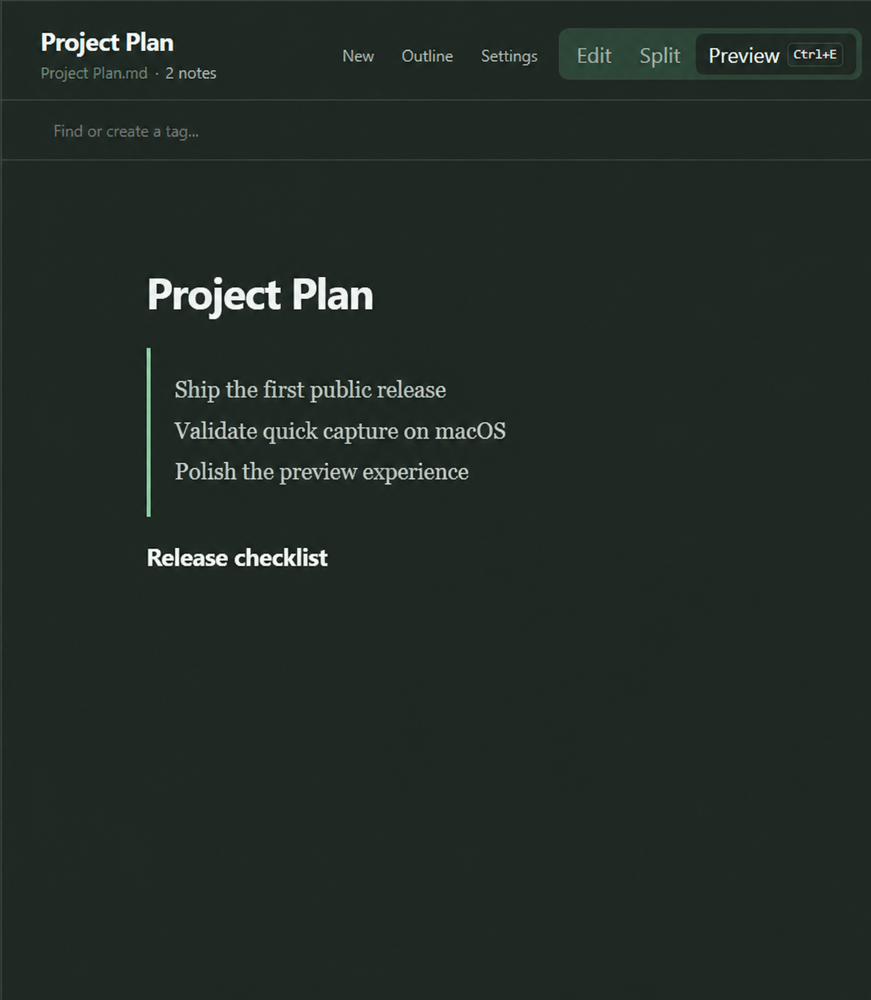
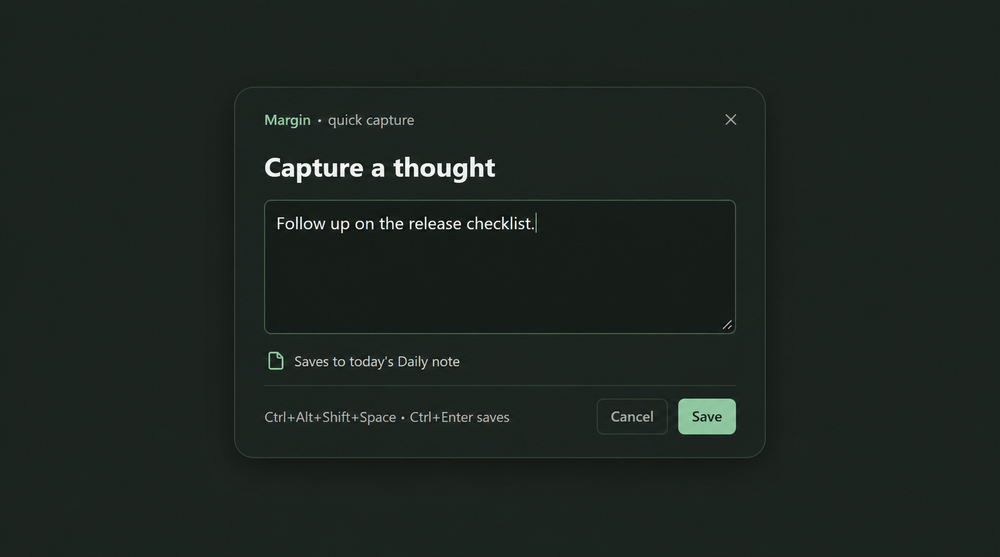

# Margin

Margin is a calm, local-first home for Markdown notes. Pick a folder, write in ordinary `.md` files, and keep using those files wherever you like.

[Get the latest release](https://github.com/mikestanaszak/margin/releases/latest) · [See what’s planned](PRODUCT_SPEC.md)



## Install Margin

### macOS

Install the latest signed release with one command:

```bash
curl -fsSL https://raw.githubusercontent.com/mikestanaszak/margin/main/install.sh | bash
```

It detects Apple Silicon or Intel, verifies the download, and installs **Margin.app** in `/Applications`.

To choose a version or install only for your user:

```bash
curl -fsSL https://raw.githubusercontent.com/mikestanaszak/margin/main/install.sh | MARGIN_VERSION=0.1.0 MARGIN_INSTALL_DIR="$HOME/Applications" bash
```

### Windows

Download the Windows installer from the [latest release](https://github.com/mikestanaszak/margin/releases/latest), then run it. Your notes stay in the folder you choose.

### Linux

Linux packaging is not published yet. You can still run Margin from source—see [Build from source](#build-from-source).

## A simpler Markdown workspace

- Your notes are normal, portable Markdown files—no database or account required.
- Browse folders, favorites, all notes, and trash without losing your place.
- Write in Edit, Preview, or Split view. Preview supports tables, syntax-highlighted code, links, and images.
- Click task checkboxes directly in Preview; Margin saves the change back to the file.
- Edit Markdown tables with rows and columns instead of hand-aligning pipes.
- Use a heading as a note title and filename, so files make sense in Finder and Explorer.
- Keep up with a familiar light or dark appearance, following your system by default.

### Quick capture

Press **Ctrl+Alt+Shift+Space** on Windows/Linux or **Command+Option+Shift+Space** on macOS to bring up a compact capture window—even when Margin is in the background. Type, press **Ctrl+Enter** (or **Command+Enter**) to save, and import captures into a daily note, an existing note, or their own file when you are ready.



## Working with notes

Choose a folder to use as your library, then create or open any Markdown note inside it. Margin indexes nested folders automatically and refreshes when files change outside the app.

Use the top search to find text across your library. Internal Markdown links and wiki links open the linked note and reveal its folder. The outline panel is available when you need a quick way to move between headings.

## Shortcuts

Margin uses **Command** on macOS and **Control** on Windows/Linux for its usual in-app shortcuts.

| Action | Shortcut |
| --- | --- |
| Edit the current note | Cmd/Ctrl + E |
| Save now | Cmd/Ctrl + S |
| Search notes | Cmd/Ctrl + K |
| Open quick capture | Cmd/Ctrl + Alt + Shift + Space |
| Save a quick capture | Cmd/Ctrl + Enter |
| Close quick capture | Escape |

Open **Settings** in Margin to see and change supported shortcuts, choose the default quick-capture destination, select a theme, and review available code-block languages.

## Updates

Margin checks for signed updates once a day and shows an unobtrusive badge in Settings when one is ready. You decide whether to download it; update packages are verified before installation.

## Your data stays yours

Margin never stores notes in a proprietary database. A library is simply a folder of UTF-8 Markdown files, including files you created before using Margin. You can open and edit the same files in other Markdown tools at any time.

## Build from source

Margin is built with Tauri 2, React, TypeScript, and Rust. To run it locally, install Node.js LTS, pnpm, Rust with the MSVC toolchain (on Windows), and the Visual Studio C++ build tools with a Windows SDK.

From the repository root:

```cmd
pnpm install
pnpm run dev:desktop
```

To create a production package:

```cmd
pnpm tauri build
```

On Windows, run Cargo commands from an **x64 Native Tools Command Prompt for VS 2022** if the linker is unavailable. For the product scope and roadmap, see [PRODUCT_SPEC.md](PRODUCT_SPEC.md).
