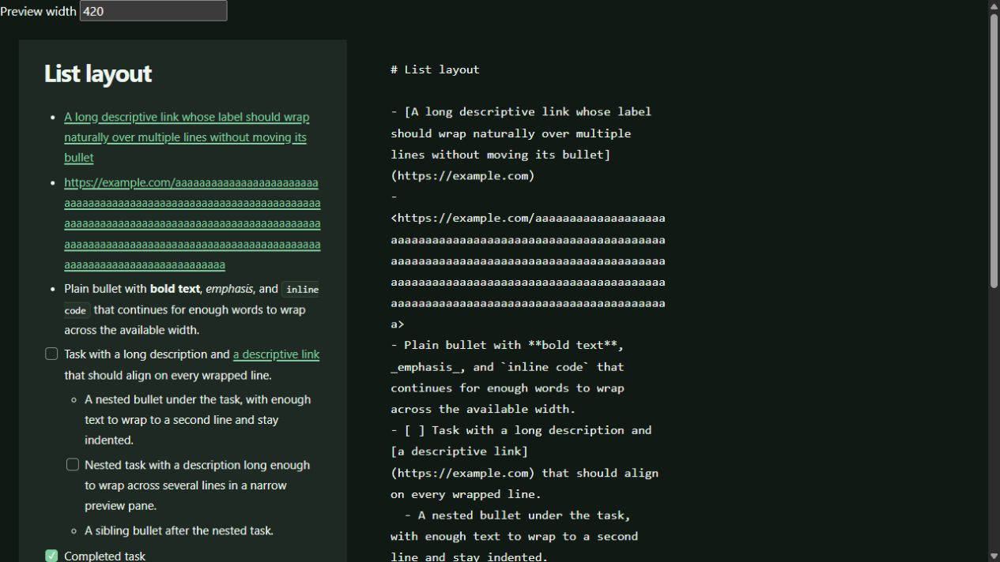
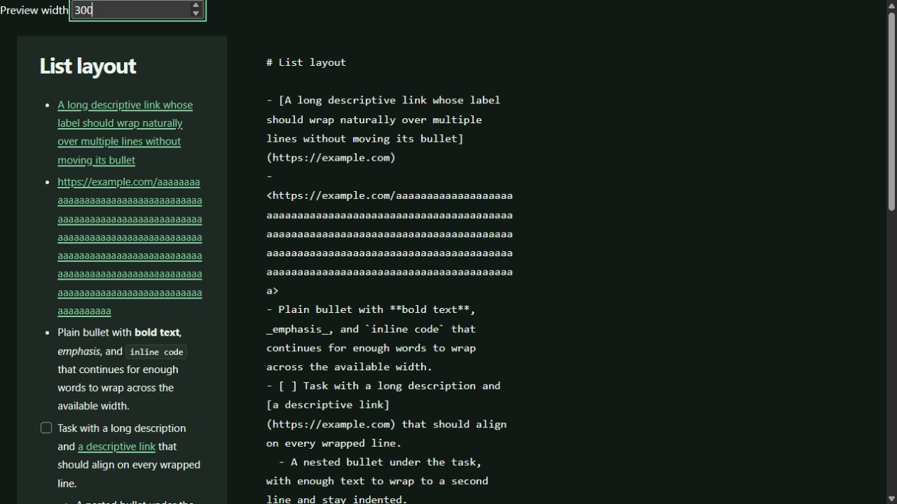

# Margin 0.5.3 desktop checkout

Date: 2026-08-28. Windows desktop, native Tauri/WebView2 development build.

Used a separate application identifier and a temporary copy of the example
library, with the three synthetic notes in `tests/fixtures/desktop-ui` added
under `UI Checks`. No personal notes or normal application preferences were
changed.

## Verified

- Mixed bullets, numbers, nested tasks, loose task paragraphs, long links,
  formatted link labels, Unicode, and inline code in Preview and Split views.
- Light and dark appearance, normal and maximized windows, resizable panes,
  readable note cards, and heading outline navigation.
- Real preview component at 300 and 420 pixels. At 300 pixels, measured
  `clientWidth` and `scrollWidth` both equal 300; long links do not overflow.
- Created `Desktop Smoke Check` through the editor, renamed it to
  `Desktop Smoke Verified`, checked its saved Markdown on disk, and reopened it.
- Toggled a nested preview task and verified `[x]` persisted to disk.
- Found the new note by its body token using search and used the quick switcher.
- Syntax highlighting, Mermaid, local images, and local note links.
- Edited a table cell, applied changes, and verified the Markdown on disk.
- Opened template management and verified the 980-pixel dialog, template
  sidebar, and side-by-side Markdown editor and rendered preview.
- Appended a synthetic external-file marker; the open preview refreshed.
- Opened Quick Capture in light appearance, saved a synthetic entry, and
  verified the entry in the temporary library's daily note.

## Findings fixed

1. Mixed task lists hid ordinary bullets; wrapped tasks and long links misaligned.
2. Missing pane preferences became zero, so fresh profiles used minimum widths.
3. Rename completion left stale blur/timer/queued saves targeting the old path.
4. Immediate note navigation could leave a draft without a pending save.
5. Relative image paths containing `..` were rejected by the native asset
   protocol. Paths are now normalized without broadening asset permissions.
6. Generic modal styles overrode feature layouts. The table editor now uses its
   intended 860-pixel width instead of the generic 480-pixel width; the template
   editor retains its two-column body and 980-pixel dialog.

## Automated verification

- `pnpm test`: 217 unit tests and 3 real Mermaid integration tests.
- `pnpm build` and the production bundle-boundary test.
- Rust: 58 tests, `cargo check`, formatting check, and Clippy with warnings denied,
  including the stricter all-targets/all-features invocation used by CI.
- `pnpm audit --prod --audit-level=low`: no known vulnerabilities.

Regression coverage includes actual preview CSS, pane preference fallbacks,
real CodeMirror rename/blur saves, queued renames, immediate editor and preview
navigation, Windows/UNC/Unix image paths, and shared modal style precedence.

## Visual evidence

These screenshots show the actual preview and editor components in a local
layout harness, not the complete native application window.

## Scope

This was a Windows desktop checkout, not a macOS or Linux runtime pass. Platform
packages are validated by the release workflow. Destructive operations and
installation over an existing personal setup were not part of this checkout.
