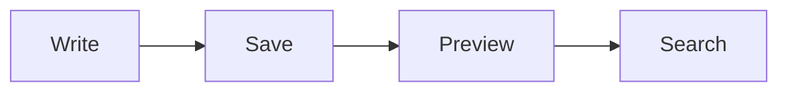

# Rich Content

## Inline formatting

**Bold**, _italic_, ~~deleted~~, `inline code`, and [a local relative link](List%20Layout.md).

> A blockquote with two lines.
> The second line stays readable.

## Table

| Feature | Status | Notes |
| --- | --- | --- |
| Lists | Check | Nested bullets and tasks |
| Links | Check | A long label with spaces |
| Unicode | Check | Café, 日本語, crème |

## Highlighted code

```typescript
const release = { version: "0.5.3", ready: true };
console.log(release);
```

## Mermaid



## Local image


## Deep outline

### Third level

Content under the third-level heading.

#### Fourth level

More content and a return to [[List Layout]].
